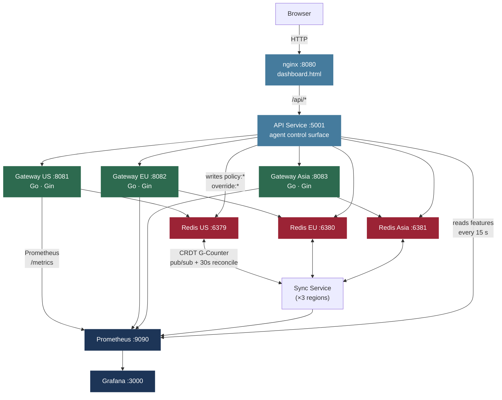
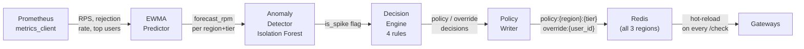
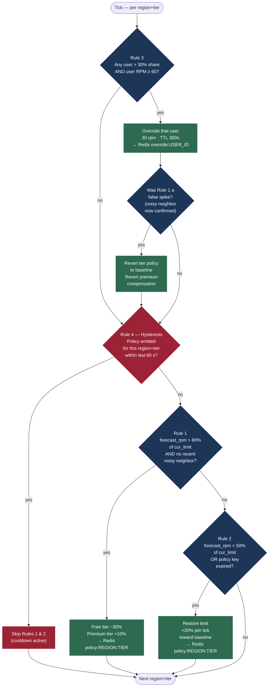
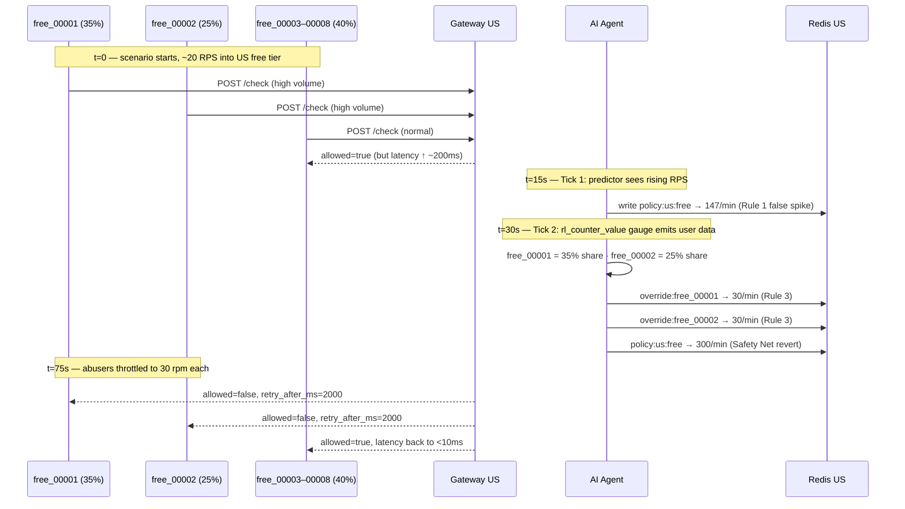
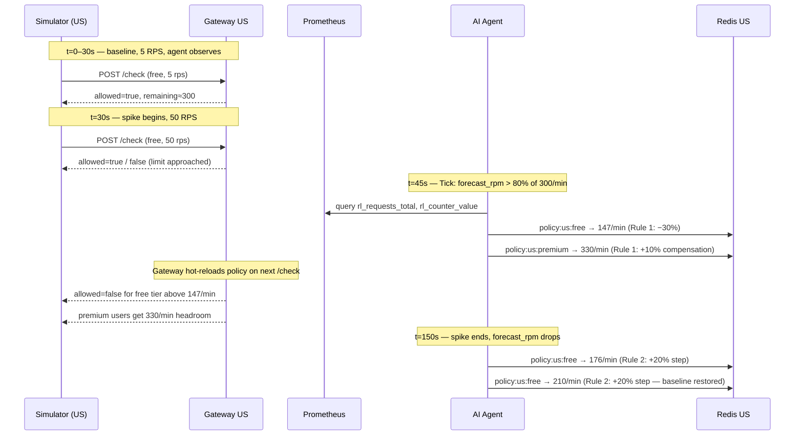

# Geo-Distributed Rate Limiter

A production-grade, geo-distributed rate limiting platform with AI-driven traffic shaping. Three regional API gateways (US, EU, Asia) enforce per-tier rate limits using token-bucket and sliding-window algorithms. A CRDT-based sync service propagates counters across regions without distributed locking. A traffic simulator generates realistic load patterns, and an AI agent on the control plane autonomously predicts spikes, detects abusers, and adjusts policies in real time — not just on a dashboard, but on the actual enforced limits.

---

## Team Members

| Name | GitHub | Contributions |
|------|--------|---------------|
| Prathamesh Sawant | [@prathamesh0421](https://github.com/prathamesh0421) | Project bootstrap, Go gateway core, token-bucket limiter, Docker Compose & deployment, dev tooling |
| Nikhil Raj | [@Nikhil1169](https://github.com/Nikhil1169) | AI agent service — EWMA/Holt-Winters predictor, spike detector, autonomous decider, policy writer, FastAPI control surface |
| Yashashav DK | [@yashashav-dk](https://github.com/yashashav-dk) | Cross-region sync service, distributed counter, Lua merge script, real-time monitoring dashboard, integration tests |
| Atharva Mokashi | [@Atharva31](https://github.com/Atharva31) | Traffic simulator, sliding-window limiter, gateway policy store & HTTP handler, Prometheus + Grafana observability |

---

## Architecture



### Three Planes

The system is organized into three planes that operate independently:

**Data plane** — The Go gateways process every `/check` request. Each gateway holds token-bucket and sliding-window state in its local Redis instance (`rl:local:{region}:{tier}:{user_id}`). The gateway reads the current policy JSON from Redis on every request, so a policy change takes effect within milliseconds — no restart required.

**Sync plane** — Three `sync-{region}` Python services run concurrently, exchanging G-Counter CRDT slots across regions every 30 seconds and on pub/sub events. Each region owns one slot in `rl:global:{tier}:{user_id}`. Merging is a simple `max()` per slot — no locking, no coordination, eventual consistency guaranteed.

**Control plane** — `agent/loop.py` ticks every 15 seconds. Each tick: read Prometheus features → fit EWMA predictor → score anomalies (Isolation Forest) → apply four-rule decision engine → write `policy:{region}:{tier}` and `override:{user_id}` back to Redis. The gateways are unaware of the agent; they simply read whatever Redis currently holds.

### Agent Control Loop (every 15 s)



### Key Design Decisions

- **Atomic Lua scripts** — Token-bucket refill and sliding-window expiry are implemented in Lua scripts executed atomically by Redis, preventing race conditions under concurrent requests.
- **CRDT G-Counter** — Counters are merged with `max()` per slot, never subtracted. This makes cross-region sync safe under partial failure: a slow region catching up will never reduce another region's count.
- **Policy as data** — Rate limits are JSON strings in Redis, not config files. The agent, the seed script, and the override API all write to the same keys. The gateway hot-reloads on every request.
- **Tier isolation** — Free, premium, and internal tiers each have independent policies, buckets, and agent decisions. A free-tier spike cannot consume premium capacity, and the agent can compensate premium users when it tightens free-tier limits.

---

## Prerequisites

| Tool | Version | Purpose |
|------|---------|---------|
| [Docker Desktop](https://www.docker.com/products/docker-desktop/) | Docker Compose v2 | Run all services — the only hard requirement |

Everything else (Go, Python, Redis) runs inside containers. No local language runtimes are needed to run or demo the system.

---

## Getting Started

```bash
# 1. Clone the repo
git clone https://github.com/Prathamesh0421/Geo-Distributed-Rate-Limiter.git
cd Geo-Distributed-Rate-Limiter

# 2. Copy environment config
cp .env.example .env

# 3. Build and start all services
docker compose -f docker-compose.production.yml up --build -d

# 4. Wait ~10 seconds, then verify all services are healthy
docker compose -f docker-compose.production.yml ps

# 5. Seed demo rate-limit policies into Redis
curl -sX POST http://localhost:5001/api/control/policies/seed

# 6. Open the dashboard
open http://localhost:8080
```

**Tear down:**
```bash
docker compose -f docker-compose.production.yml down
```

**Reset mid-demo** (clears Redis state, re-seeds policies, restarts agent):
```bash
./tools/demo-reset.sh
```

---

## Services & Ports

| Service | Port | Description |
|---------|------|-------------|
| `dashboard` (nginx) | 8080 | Real-time monitoring UI |
| `api` | 5001 | Agent control surface (REST) |
| `gateway-us` | 8081 | Rate-limiting gateway — US region |
| `gateway-eu` | 8082 | Rate-limiting gateway — EU region |
| `gateway-asia` | 8083 | Rate-limiting gateway — Asia region |
| `redis-us` | 6379 | Counter store — US |
| `redis-eu` | 6380 | Counter store — EU |
| `redis-asia` | 6381 | Counter store — Asia |
| `prometheus` | 9090 | Metrics scraping |
| `grafana` | 3000 | Dashboards (login: `admin` / `admin`) |

---

## The Problem: Rate Limiting Without Intelligence

A naive rate limiter enforces a per-tier cap — say, 300 requests per minute for free-tier users. This protects the system against runaway clients in aggregate, but it has a fundamental flaw: **it cannot distinguish between many legitimate users and one abusive one**.

### Scenario: Noisy Neighbor (Without the Agent)

Imagine two free-tier users — `free_00001` and `free_00002` — together consuming 60% of the US free-tier quota. Six other free-tier users (`free_00003` through `free_00008`) are making normal requests.

Without intelligent traffic shaping:
- The tier aggregate sits near its limit. The gateway starts rejecting requests.
- `free_00001` and `free_00002` keep hammering — they don't back off.
- `free_00003`–`00008` start getting rejected too, even though they each use a small fraction of the quota.
- Backend congestion from the abusers causes ~200 ms of additional latency for **all** users in the tier.
- Nothing changes until the minute window resets.

The tier limit was not the problem. The problem was that traffic was **concentrated**, and a single blunt limit cannot fix that.

---

## The Solution: AI-Driven Traffic Shaping

The agent operates on the control plane. It ticks every 15 seconds and applies four rules:



### Rule 1 — Predicted Spike Mitigation (Tier-Level)

**When:** The EWMA predictor forecasts that request rate will exceed 80% of the current free-tier limit, and the spike appears distributed (no single abuser identified yet).

**What happens:** The agent reduces the free-tier limit by 30% (`new_limit = cur_limit × 0.70`, floored at 10 rpm). Simultaneously, it raises the premium-tier limit by 10% — compensating paying users who might be caught in the load wave.

**Why tier-level, not user-level:** When traffic is genuinely distributed (a real product launch, a viral event), there is no single user to throttle. Reducing the tier-wide limit sheds load proportionally across all free-tier users, protecting premium and internal traffic.

### Rule 2 — Capacity Restoration

**When:** The forecasted request rate drops below 50% of the current limit and the rejection rate is non-zero (the limit had previously been tightened), or the policy key has expired from Redis entirely.

**What happens:** The agent restores the limit toward the seeded baseline in 20% increments per tick, or immediately if the key is missing.

**Why incremental:** Slamming capacity back to the baseline risks re-triggering the spike condition. Stepping up at 20% per tick gives the predictor one tick of visibility at each new limit before the next decision.

### Rule 3 — Noisy Neighbor Override (Per-User)

**When:** A single user holds more than 30% of tier traffic **and** is generating at least 60 requests per minute (1 rps). This rule runs before the hysteresis gate so it fires even if Rule 1 or 2 touched the same tier in the last 60 seconds.

**What happens:** The agent writes a per-user `override:{user_id}` key in Redis, capping that specific user at 30 requests per minute. Legitimate users in the same tier are unaffected.

**Why per-user, not tier-wide:** A noisy neighbor is a concentration problem, not a load problem. Dropping the tier limit hurts everyone. A targeted override pins only the abuser — the other users' effective capacity is restored as soon as the abuser is throttled.

**Why Rule 3 runs before the hysteresis gate:** In practice, the predictor may see a rising tier RPS on Tick N and fire Rule 1 (tier-wide), before the `rl_counter_value` gauge has populated enough to reveal the abuser. On Tick N+1, when the abuser is identified, Rule 3 must still fire even though Rule 1 just touched this tier 15 seconds ago. Decoupling Rule 3 from the hysteresis gate is what makes the recovery happen at ~75 seconds instead of waiting out a full 60-second cooldown.

### Rule 4 — Hysteresis Gate

**When:** Any policy decision was emitted for a (region, tier) pair within the last 60 seconds.

**What happens:** Rules 1 and 2 are skipped for that pair. Rule 3 (per-user overrides) is not affected.

**Why:** Without hysteresis, the agent would fire multiple consecutive tightening decisions as the predictor's estimate catches up to reality, cascading the limit to the floor in 3–4 ticks. The 60-second gate means at most one tier-wide change per minute per (region, tier).

---

## Demo Flow

The full demo runs approximately 8 minutes. All scenarios are triggered from the dashboard at `http://localhost:8080`.

### Before You Start

Warm the agent for at least 90 seconds before running a scenario. The EWMA predictor needs a baseline to compare against — without it, the first few ticks will see every traffic change as an anomaly.

```bash
# Start the agent
curl -sX POST http://localhost:5001/api/control/agent/start

# Run global_steady for 90 seconds (warm-up)
curl -sX POST http://localhost:5001/api/control/scenario \
  -H 'Content-Type: application/json' \
  -d '{"scenario":"global_steady"}'
```

Then open the dashboard and confirm: Container Health is green, agent status shows "Running", and the predictor shows sample count > 0.

---

### Scene 1: Global Steady State (~2 min)

**Simulator:** Three regions running at 3 / 2 / 1.5 RPS with a gentle diurnal sine overlay.

**What to watch:** Allow rate ≈ 100%. No agent decisions. No overrides. All tiers comfortably under their limits. This is the baseline — the agent observes but does not act.

**Why this matters:** It establishes that the system is healthy. When the next scenario fires and the agent *does* act, the contrast is visible.

---

### Scene 2: Noisy Neighbor (~2 min)

**Simulator:** `free_00001` takes 35% of US free-tier traffic, `free_00002` takes 25%. Six legitimate users share the remaining 40%. Total throughput: ~20 RPS into US.

**What to watch without the agent:** Latency tile climbs to ~200 ms. Allow rate drops. All eight users are affected — including `free_00003`–`00008` who did nothing wrong.

**What happens with the agent running:**

- Tick 1 (~15 s): Predictor sees rising tier RPS. If it fires Rule 1 before user-level gauge data is ready, it briefly tightens the free-tier limit (false spike classification).
- Tick 2 (~30 s): `rl_counter_value` gauge emits per-user data. Agent identifies `free_00001` at 35% share, `free_00002` at 25% share. Rule 3 fires: both users capped at 30 rpm. If Rule 1 previously fired a false spike, the Safety Net reverts the tier-wide limit and the premium compensation simultaneously.
- ~75 s total: Both abusers are throttled. Tier latency drops back to <10 ms. `free_00003`–`00008` are unaffected and continue at full speed.

**Decision log entries to highlight:**
```
noisy_neighbor_free_00001   → override, 30/min, TTL 300s
noisy_neighbor_free_00002   → override, 30/min, TTL 300s
undo_false_spike_due_to_noisy_neighbor   → policy restored to baseline
```



---

### Scene 3: Product Launch (~2.5 min)

**Simulator:** 30 seconds of US baseline at 5 RPS, then a 10× spike to 50 RPS for 120 seconds. EU and Asia stay at baseline for the full run.

**What to watch:** The spike is organic — no single abuser, just a real surge in demand. The agent cannot throttle an individual user because every user is behaving normally.

**What happens with the agent running:**

- Baseline phase: predictor fits the 5 RPS normal for US free tier.
- Spike begins: within one tick, forecasted RPM crosses 80% of the free-tier limit. Agent fires Rule 1.
- Free-tier limit drops 30%: `predicted_spike_us_free`.
- Premium-tier limit rises 10%: `predicted_spike_us_premium_compensation` — paying users get more headroom, not less.
- As the spike sustains, the hysteresis gate prevents further tightening for 60 seconds.
- After the spike passes: Rule 2 fires to restore limits in 20% steps per tick.

**Why this is a different answer than the noisy-neighbor scenario:** The problem is different. A surge is distributed — 30 users each sending 10× their normal rate. The right response is to reduce the tier-wide cap so the system stays stable, then restore it as demand falls. Targeting individual users with overrides would do nothing, because no single user is disproportionate.

**Decision log entries to highlight:**
```
predicted_spike_us_free                      → policy, free 210 → 147/min
predicted_spike_us_premium_compensation      → policy, premium +10%
restore_capacity_us_free                     → policy, 147 → 176 → 210/min (stepped)
```



---

### Scene 4: Region Failover (~2 min)

**Simulator:** All three regions running at 15 / 8 / 6 RPS.

**What to watch:** While the sim runs, stop the US gateway from a separate terminal:

```bash
docker stop gateway-us
```

The dashboard's Container Health pill for US flips red. US RPS drops to zero. EU and Asia continue serving without interruption — their Redis instances and sync services are independent. Bring US back:

```bash
docker start gateway-us
```

Container Health turns green. US RPS recovers as the gateway reconnects to Redis and resumes processing.

**Why the agent does nothing:** This is not a traffic pattern the agent needs to address — it is a physical failure. The geographic isolation is structural: each region has its own Redis, its own gateway, and its own sync service. No cross-region coordination is required for EU and Asia to keep serving while US is down.

**What the agent *would* do if it detected elevated EU/Asia traffic:** If EU traffic spiked because clients rerouted from US, the agent would eventually fire Rule 1 for EU. In this demo the rerouting is not simulated, but the mechanism is the same.

---

## Backup Talk Track

If a scenario stalls or the simulator stops emitting, these commands give you live data to talk through:

```bash
# Show the current policy for US free tier
docker exec redis-us redis-cli GET policy:us:free | python3 -m json.tool

# Show all active policy keys
docker exec redis-us redis-cli KEYS 'policy:*'

# Show the CRDT G-counter for a user across all three Redis instances
docker exec redis-us   redis-cli HGETALL rl:global:free:free_00001
docker exec redis-eu   redis-cli HGETALL rl:global:free:free_00001
docker exec redis-asia redis-cli HGETALL rl:global:free:free_00001

# Tail the agent decision log in real time
docker exec api tail -f /app/agent/decisions.jsonl
```

---

## Repository Structure

```
.
├── gateway/                    # Go API gateway (Gin)
│   ├── main.go                 # Entry point, router setup
│   ├── internal/
│   │   ├── limiter/            # Token-bucket & sliding-window (Go + Lua)
│   │   ├── policy/             # Policy store — reads/writes Redis JSON
│   │   ├── override/           # Per-user override cache
│   │   ├── handler/            # HTTP handler — /check, /health, /metrics
│   │   └── metrics/            # Prometheus metric definitions
│   ├── Dockerfile
│   └── go.mod
│
├── sync/                       # Python CRDT sync service
│   ├── sync_service.py         # Main sync loop — merges G-Counters across regions
│   ├── counter.py              # G-Counter CRDT implementation
│   ├── state.py                # Shared state management
│   ├── admin.py                # Admin REST endpoints
│   ├── merge.lua               # Atomic Redis merge script
│   └── tests/
│       ├── test_counter.py     # Unit tests for CRDT logic
│       └── test_integration.py # End-to-end sync tests
│
├── agent/                      # Python AI traffic agent
│   ├── loop.py                 # Main autonomous control loop (15s tick)
│   ├── predictor.py            # EWMA + Holt-Winters traffic forecasting
│   ├── detector.py             # Spike / anomaly detection (Isolation Forest)
│   ├── decider.py              # Four-rule decision engine
│   ├── policy_writer.py        # Writes decisions back to Redis
│   ├── metrics_client.py       # Prometheus query client
│   ├── api.py                  # FastAPI control surface
│   ├── decision_log.py         # Structured decision logging (decisions.jsonl)
│   ├── notebooks/
│   │   └── predictor_eval.ipynb  # EWMA vs Holt-Winters evaluation
│   └── tests/
│       ├── test_predictor.py
│       ├── test_detector.py
│       ├── test_decider.py
│       └── test_policy_writer.py
│
├── simulator/                  # Python traffic simulator
│   ├── engine.py               # Core simulation engine (Poisson streams)
│   ├── population.py           # User population model (free/premium/internal)
│   ├── scenarios.py            # Scenario definitions
│   ├── stats.py                # Stats collection and reporting
│   └── tests/
│       ├── test_patterns.py
│       └── test_population.py
│
├── infra/
│   ├── prometheus.yml          # Prometheus scrape config
│   └── grafana/provisioning/   # Pre-built Grafana dashboards & datasources
│
├── docs/
│   ├── contracts.md            # API, Redis, metrics & policy contracts
│   ├── sync-design.md          # CRDT sync protocol design
│   ├── failure-modes.md        # Failure analysis & recovery
│   ├── demo-prep.md            # Demo scenario runbook
│   └── phase7/architecture.md  # AI agent architecture
│
├── tools/
│   ├── seed_policies.py        # Seed demo rate-limit policies into Redis
│   ├── demo-reset.sh           # Full reset: flush Redis, re-seed, restart agent
│   └── diagnose_ratelimit.py   # Diagnostic script for live debugging
│
├── dashboard.html              # Single-file real-time dashboard UI
├── config.yaml                 # Central config (overridable via env vars)
├── docker-compose.yml          # Dev compose (infra only — Redis, Prometheus, Grafana)
├── docker-compose.production.yml  # Full production compose (all services)
└── nginx.conf                  # nginx reverse proxy config
```

---

## API Reference

### Gateway — `POST /check`

Every rate-limit decision goes through this endpoint. The gateway enforces the current policy from Redis atomically.

```bash
curl -X POST http://localhost:8081/check \
  -H "Content-Type: application/json" \
  -d '{"user_id": "u123", "tier": "free", "region": "us", "endpoint": "/api/data"}'
```

```json
{
  "allowed": true,
  "remaining": 42,
  "limit": 60,
  "retry_after_ms": 0,
  "policy_id": "pol_1746000000_1"
}
```

Always returns HTTP 200. `allowed: false` means rate-limited; the caller should back off for `retry_after_ms` milliseconds.

### Agent Control API — `POST /api/control/...`

| Endpoint | Description |
|----------|-------------|
| `POST /api/control/policies/seed` | Seed all regions with default demo policies |
| `POST /api/control/agent/start` | Start the autonomous agent loop |
| `POST /api/control/agent/stop` | Stop the agent loop |
| `POST /api/control/scenario` | Start a simulator scenario (`{"scenario": "noisy_neighbor"}`) |
| `GET  /api/decisions` | Fetch recent agent decisions (filtered to current scenario by default) |
| `GET  /api/status` | Stack health — gateway, Redis, Prometheus, agent state |

### Override a User's Limit

The override API lets you pin a specific user to a custom limit, bypassing their tier policy. Useful for VIP users or support escalations.

```bash
curl -X POST http://localhost:5001/api/control/override \
  -H "Content-Type: application/json" \
  -d '{"user_id": "u123", "limit_per_minute": 1000, "ttl": 3600, "reason": "VIP user"}'
```

Full contract details in [docs/contracts.md](docs/contracts.md).

---

## Running Tests

Each service has its own test suite. All Python tests use `fakeredis` — no live Redis required.

```bash
# Agent tests (predictor, detector, decider, policy writer)
docker exec api pytest agent/tests/ -v

# Sync service tests (unit + integration)
docker exec sync-us pytest sync/tests/ -v

# Gateway tests (Go)
docker exec gateway-us go test ./... -v
```

To run tests locally outside Docker, create a virtualenv first:

```bash
python -m venv .venv && source .venv/bin/activate
pip install -r agent/requirements.txt
pytest agent/tests/ sync/tests/ simulator/tests/ -v
```

---

## Configuration

All settings are in [`config.yaml`](config.yaml) and can be overridden via environment variables. Copy [`.env.example`](.env.example) to `.env` before starting:

```bash
cp .env.example .env
```

| Variable | Default | Description |
|----------|---------|-------------|
| `ENVIRONMENT` | `development` | `development` or `production` |
| `REDIS_US_HOST` | `redis-us` | Redis host for US region (container name in Docker) |
| `GATEWAY_US_URL` | `http://gateway-us:8081` | US gateway URL (internal to Docker network) |
| `API_PORT` | `5001` | Agent API port |
| `DASHBOARD_API_URL` | `http://localhost:5001` | URL the browser polls for dashboard data |

---

## Observability

- **Dashboard** — `http://localhost:8080` — real-time request rates, tier breakdowns, agent decisions, active overrides, container health.
- **Grafana** — `http://localhost:3000` (admin/admin) — 25 pre-provisioned panels covering CRDT sync lag, policy version history, decision latency histograms, and per-tier token-bucket values.
- **Prometheus** — `http://localhost:9090` — raw metrics.

Key metrics:

| Metric | Labels | Description |
|--------|--------|-------------|
| `rl_requests_total` | region, tier, endpoint, decision | Allow/deny counter |
| `rl_decision_duration_seconds` | region | Gateway decision latency histogram |
| `rl_counter_value` | region, tier, user_id | Live token-bucket values (sampled top-N) |
| `rl_sync_lag_seconds` | from_region, to_region | Cross-region CRDT sync lag |
| `rl_policy_version` | region, tier | Policy change tracking |
